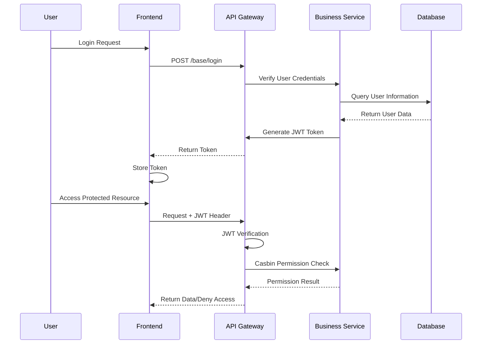

# Project Introduction

**Gin-Vue-Admin** is a full-stack management framework designed for rapid development of web applications with a complete frontend-backend separation architecture. Built on Go (Gin) and Vue.js, it provides a comprehensive development platform with automated code generation, AI-assisted development, and enterprise-grade security features.

## 🚀 Quick Links

* **GitHub**: [https://github.com/flipped-aurora/gin-vue-admin](https://github.com/flipped-aurora/gin-vue-admin)
* **GitCode**: [https://gitCode.com/flipped-aurora/gin-vue-admin](https://gitCode.com/flipped-aurora/gin-vue-admin)
* **Gitee**: [https://gitee.com/pixelmax/gin-vue-admin](https://gitee.com/pixelmax/gin-vue-admin)
* **Online Demo**: [http://demo.gin-vue-admin.com/](http://demo.gin-vue-admin.com/)
  - Username: `admin`
  - Password: `123456`

## 🎯 Project Positioning

Gin-Vue-Admin serves as a foundational framework for enterprise management systems, focusing on providing developers with:

- **🚀 Rapid Development**: AutoCode generation system that can generate complete CRUD functionality in 1 minute
- **🔒 Enterprise Security**: Dual security guarantee with JWT authentication + Casbin RBAC authorization
- **🔧 High Flexibility**: Dynamic routing, menu management, and API configuration
- **📚 Complete Documentation**: Automatic Swagger API documentation generation
- **☁️ Cloud Native**: Multi-cloud file storage support (Qiniu Cloud, Alibaba Cloud, AWS S3)
- **🗄️ Multi-Database**: Support for MySQL, PostgreSQL, SQLite, and MSSQL

This system is primarily targeted at developers building management backends, content management systems, and business applications requiring user management and permission control.


## 🛠️ Technology Stack

::: warning Environment Requirements
- **Node.js**: ≥ 18.16.2
- **Go**: ≥ 1.22
- **MySQL**: ≥ 5.7 (engine must be InnoDB)
- **Git**: Version control tool

It is recommended to use Docker to create MySQL database to ensure environment consistency
:::

### Frontend Technology Stack

| Technology | Version | Description |
|------|------|------|
| **Vue.js** | 3.3.4 | Progressive JavaScript framework |
| **Element Plus** | 2.3.8 | Vue 3 UI component library |
| **Pinia** | Latest | State management (replacement for Vuex) |
| **Vue Router** | Latest | SPA routing and dynamic routing |
| **Vite** | Latest | Build tool and development server |

### Backend Technology Stack

| Technology | Version | Description |
|------|------|------|
| **Go** | ≥ 1.22 | Programming language |
| **Gin** | 1.9.1 | High-performance web framework |
| **GORM** | 1.25.2 | ORM library with automatic migration support |
| **Casbin** | Latest | Access control library (RBAC) |

### Database Support

| Database | Version Requirement | Description |
|--------|----------|------|
| **MySQL** | ≥ 5.7 | Primary database, InnoDB engine |
| **PostgreSQL** | ≥ 9.6 | Relational database alternative |
| **SQLite** | Latest | Embedded database option |
| **MS SQL Server** | Latest | Microsoft database support |
| **Oracle** | Latest | Enterprise database support |

### Cache and Storage

- **Redis**: Cache and session management
- **Qiniu Cloud**: Object storage service
- **Alibaba Cloud OSS**: Alibaba Cloud storage
- **AWS S3**: Amazon Web Services storage

### Development Tools

- **Swagger**: Automatic API documentation generation
- **Viper**: Configuration management
- **Zap**: Structured logging
- **fsnotify**: File system notifications

### AI Integration

- **LLM APIs**: AI-assisted code generation
- **MCP Protocol**: Model Context Protocol for AI agents

## 🌟 Core Features

### 🔐 Security Authentication System
- **JWT Authentication**: Stateless user identity verification
- **Casbin RBAC**: Role-based access control
- **Multi-point Login Control**: Support for single sign-on restrictions
- **API Permission Management**: Fine-grained interface access control

### 👥 User Permission Management
- **User Management**: System administrators assign user roles and permissions
- **Role Management**: Create permission control objects, support API, menu, and button permission allocation
- **Menu Management**: Dynamic menu configuration, different menus for different roles
- **Button Permissions**: Page-level operation permission control

### 🚀 Rapid Development Tools
- **AutoCode Generator**: Code generator that creates complete CRUD functionality in 1 minute
- **Form Generator**: Visual form design based on [Variant Form](https://www.vform666.com/)
- **Automatic API Documentation**: Swagger automatic API documentation generation
- **RESTful Examples**: Standard RESTful API design reference

### 📁 File Storage System
- **Multi-cloud Storage**: Support for local, Qiniu Cloud, Alibaba Cloud, and Tencent Cloud storage
- **Chunked Upload**: Large file chunked upload functionality
- **Resume Upload**: Continue uploading after file upload interruption
- **File Management**: Complete file upload and download management

### 🔧 System Management
- **Configuration Management**: Frontend visual configuration file modification
- **Log Management**: System operation log recording and query
- **Monitoring Dashboard**: System runtime status monitoring
- **Data Dictionary**: System data dictionary management

### 🎨 User Interface
- **Rich Text Editor**: Built-in MarkDown editor
- **Conditional Search**: Advanced search functionality examples
- **Data Import/Export**: Excel data processing functionality
- **Responsive Design**: Adapts to multiple device screens

### 🔌 Plugin Ecosystem
- **Plugin Center** <Badge type="tip" text="NEW" class="bg-indigo-600 font-medium dark:bg-indigo-500" />: Go plugin center based on GVA design
- **WeChat Integration**: WeChat payment, login and other functional plugins
- **K8s Operations**: Kubernetes-related operation plugins
- **Third-party Login**: Support for multiple third-party login methods

## How to Contribute

Before participating in any form, please read the development guide first. If you have any opinions or suggestions, you are welcome to inform us by creating [Issues](https://github.com/flipped-aurora/gin-vue-admin/issues) or [PRs](https://github.com/flipped-aurora/gin-vue-admin/pulls). You can also choose the gva [official discussion group](https://plugin.gin-vue-admin.com/#/layout/vip)
::: warning 🧁
It is strongly recommended to read [《How to Ask Questions the Smart Way》](https://github.com/ryanhanwu/How-To-Ask-Questions-The-Smart-Way) and [《How to Ask Questions to Open Source Communities》](https://github.com/seajs/seajs/issues/545). Better questions are more likely to get help.
:::

## 🏗️ System Architecture

### Overall Architecture Design

Gin-Vue-Admin adopts a modern frontend-backend separation architecture, ensuring system maintainability and scalability through clear layered design:

```
┌─────────────────┐    ┌─────────────────┐    ┌─────────────────┐
│  Frontend (Vue) │    │  Backend (Go)   │    │   Data Layer    │
├─────────────────┤    ├─────────────────┤    ├─────────────────┤
│ • Vue 3 + Vite  │    │ • Gin Framework │    │ • MySQL/PG/...  │
│ • Element Plus  │◄──►│ • JWT + Casbin  │◄──►│ • Redis Cache   │
│ • Pinia Store   │    │ • GORM ORM      │    │ • File Storage  │
│ • Vue Router    │    │ • Swagger Docs  │    │ • Cloud Storage │
└─────────────────┘    └─────────────────┘    └─────────────────┘
```

### System Architecture Diagram


### Core Architecture Components

#### 🎨 Frontend Architecture (Vue.js + Vite)
- **Application Startup**: `main.js` - Application bootstrap
- **Routing System**: Vue Router - Dynamic routing management
- **State Management**: Pinia Stores - Global state management
- **Layout System**: Header, Aside, Tabs - Page layout components
- **Permission Control**: Menu permissions, API permissions, button permissions
- **Component Library**: Upload, Select, Export - Common business components

#### ⚙️ Backend Architecture (Go + Gin)
- **Service Startup**: `main.go` - Server bootstrap program
- **Configuration System**: `core.Viper` - Configuration management system
- **Authentication Middleware**: `middleware.JWT` - JWT identity verification
- **Authorization Middleware**: `middleware.Casbin` - Permission control processing
- **API Handlers**: `api.v1` - REST API handlers
- **Business Services**: `service.*` - Business logic services
- **Code Generation**: `service.AutoCode` - Automatic code generation engine

#### 🗄️ Data Architecture
- **Main Database**: `global.GVA_DB` - Primary data storage
- **Cache System**: `global.GVA_REDIS` - Cache and sessions
- **File Storage**: Local/cloud object storage services
- **Permission Storage**: `system.CasbinRule` - Policy storage

### Authentication and Authorization Flow



### Frontend Detailed Design Diagram

*Provided by: <a href="https://github.com/baobeisuper">baobeisuper</a>*


### Initialization Process

The initialization sequence during system startup ensures proper loading of all components:

1. **Configuration Initialization**: `core.Viper` - Load configuration files
2. **Log Initialization**: `core.Zap` - Set up logging system
3. **Database Connection**: `initialize.Gorm` - Establish database connection
4. **Data Table Registration**: `initialize.RegisterTables` - Register data models
5. **Redis Connection**: `initialize.Redis` - Establish cache connection
6. **Route Initialization**: `initialize.Routers` - Set up API routes
7. **Service Startup**: `core.RunWindowsServer` - Start HTTP service
