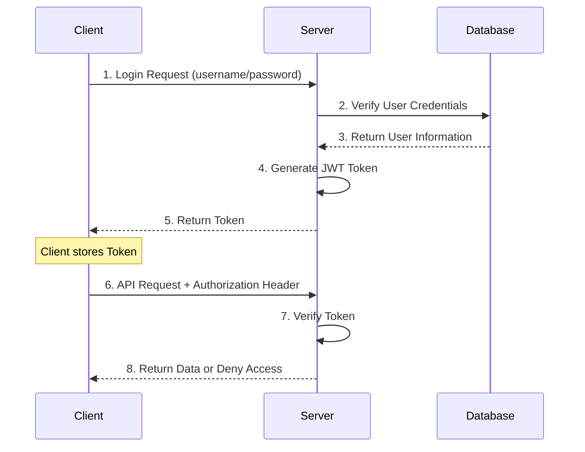

# 🔐 Authentication System

Gin-Vue-Admin uses JWT (JSON Web Token) as the primary identity authentication mechanism, providing a stateless, secure, and efficient user authentication solution.

## 🎯 Authentication Mechanism Overview

### JWT Authentication Flow



## 🔧 JWT Configuration

### Configuration File Settings

Configure JWT-related parameters in `config.yaml`:

```yaml
jwt:
  signing-key: 'qmPlus'           # JWT signing key
  expires-time: 604800s           # Token expiration time (7 days)
  buffer-time: 86400s             # Token buffer time (1 day)
  issuer: 'qmPlus'               # Issuer
```

### Configuration Parameters Description

| Parameter | Type | Description | Default Value |
|------|------|------|--------|
| `signing-key` | string | JWT signing key for generating and verifying tokens | qmPlus |
| `expires-time` | duration | Token validity period, requires re-login after expiration | 604800s (7 days) |
| `buffer-time` | duration | Token buffer time, can refresh token within this time | 86400s (1 day) |
| `issuer` | string | Token issuer identifier | qmPlus |

## 🛠️ Core Components

### JWT Middleware

Location: `server/middleware/jwt.go`

```go
// JWTAuth JWT authentication middleware
func JWTAuth() gin.HandlerFunc {
    return func(c *gin.Context) {
        // Get token from request header
        token := c.Request.Header.Get("x-token")
        if token == "" {
            response.FailWithDetailed(gin.H{"reload": true}, "Not logged in or illegal access", c)
            c.Abort()
            return
        }
        
        // Verify token
        j := utils.NewJWT()
        claims, err := j.ParseToken(token)
        if err != nil {
            if err == utils.TokenExpired {
                response.FailWithDetailed(gin.H{"reload": true}, "Authorization expired", c)
                c.Abort()
                return
            }
            response.FailWithDetailed(gin.H{"reload": true}, err.Error(), c)
            c.Abort()
            return
        }
        
        // Store user information in context
        c.Set("claims", claims)
        c.Next()
    }
}
```

### JWT Utility Class

Location: `server/utils/jwt.go`

```go
type JWT struct {
    SigningKey []byte
}

type CustomClaims struct {
    BaseClaims
    BufferTime int64
    jwt.StandardClaims
}

type BaseClaims struct {
    UUID        uuid.UUID
    ID          uint
    Username    string
    NickName    string
    AuthorityId string
}

// CreateToken Create Token
func (j *JWT) CreateToken(claims CustomClaims) (string, error) {
    token := jwt.NewWithClaims(jwt.SigningMethodHS256, claims)
    return token.SignedString(j.SigningKey)
}

// ParseToken Parse Token
func (j *JWT) ParseToken(tokenString string) (*CustomClaims, error) {
    token, err := jwt.ParseWithClaims(tokenString, &CustomClaims{}, func(token *jwt.Token) (interface{}, error) {
        return j.SigningKey, nil
    })
    
    if err != nil {
        if ve, ok := err.(*jwt.ValidationError); ok {
            if ve.Errors&jwt.ValidationErrorMalformed != 0 {
                return nil, TokenMalformed
            } else if ve.Errors&jwt.ValidationErrorExpired != 0 {
                return nil, TokenExpired
            } else if ve.Errors&jwt.ValidationErrorNotValidYet != 0 {
                return nil, TokenNotValidYet
            } else {
                return nil, TokenInvalid
            }
        }
    }
    
    if claims, ok := token.Claims.(*CustomClaims); ok && token.Valid {
        return claims, nil
    }
    return nil, TokenInvalid
}
```

## 🔑 Login Implementation

### Login API

Location: `server/api/v1/sys_user.go`

```go
// Login User login
func (b *BaseApi) Login(c *gin.Context) {
    var l systemReq.Login
    err := c.ShouldBindJSON(&l)
    if err != nil {
        response.FailWithMessage(err.Error(), c)
        return
    }
    
    // Captcha verification
    if store.Verify(l.CaptchaId, l.Captcha, true) {
        // Verify user credentials
        u := &system.SysUser{Username: l.Username, Password: l.Password}
        user, err := userService.Login(u)
        if err != nil {
            global.GVA_LOG.Error("Login failed! Username does not exist or password is incorrect!", zap.Error(err))
            response.FailWithMessage("Username does not exist or password is incorrect", c)
            return
        }
        
        // Generate JWT Token
        b.tokenNext(c, *user)
    } else {
        response.FailWithMessage("Captcha error", c)
    }
}

// tokenNext Generate Token and return
func (b *BaseApi) tokenNext(c *gin.Context, user system.SysUser) {
    j := &utils.JWT{SigningKey: []byte(global.GVA_CONFIG.JWT.SigningKey)}
    claims := j.CreateClaims(utils.BaseClaims{
        UUID:        user.UUID,
        ID:          user.ID,
        NickName:    user.NickName,
        Username:    user.Username,
        AuthorityId: user.AuthorityId,
    })
    
    token, err := j.CreateToken(claims)
    if err != nil {
        global.GVA_LOG.Error("Failed to get token!", zap.Error(err))
        response.FailWithMessage("Failed to get token", c)
        return
    }
    
    // Multi-point login control
    if !global.GVA_CONFIG.System.UseMultipoint {
        response.OkWithDetailed(systemRes.LoginResponse{
            User:      user,
            Token:     token,
            ExpiresAt: claims.StandardClaims.ExpiresAt * 1000,
        }, "Login successful", c)
        return
    }
    
    // Single sign-on processing
    if jwtStr, err := jwtService.GetRedisJWT(user.Username); err == redis.Nil {
        if err := jwtService.SetRedisJWT(token, user.Username); err != nil {
            global.GVA_LOG.Error("Failed to set login status!", zap.Error(err))
            response.FailWithMessage("Failed to set login status", c)
            return
        }
        response.OkWithDetailed(systemRes.LoginResponse{
            User:      user,
            Token:     token,
            ExpiresAt: claims.StandardClaims.ExpiresAt * 1000,
        }, "Login successful", c)
    } else if err != nil {
        global.GVA_LOG.Error("Failed to set login status!", zap.Error(err))
        response.FailWithMessage("Failed to set login status", c)
    } else {
        var blackJWT system.JwtBlacklist
        blackJWT.Jwt = jwtStr
        if err := jwtService.JsonInBlacklist(blackJWT); err != nil {
            response.FailWithMessage("JWT invalidation failed", c)
            return
        }
        if err := jwtService.SetRedisJWT(token, user.Username); err != nil {
            response.FailWithMessage("Failed to set login status", c)
            return
        }
        response.OkWithDetailed(systemRes.LoginResponse{
            User:      user,
            Token:     token,
            ExpiresAt: claims.StandardClaims.ExpiresAt * 1000,
        }, "Login successful", c)
    }
}
```

## 🔄 Token Refresh Mechanism

### Automatic Refresh

When the token is about to expire (within the buffer-time), the system will automatically refresh the token:

```go
// RefreshToken Refresh Token
func (j *JWT) RefreshToken(tokenString string) (string, error) {
    jwt.TimeFunc = func() time.Time {
        return time.Unix(0, 0)
    }
    
    token, err := jwt.ParseWithClaims(tokenString, &CustomClaims{}, func(token *jwt.Token) (interface{}, error) {
        return j.SigningKey, nil
    })
    
    if err != nil {
        return "", err
    }
    
    if claims, ok := token.Claims.(*CustomClaims); ok && token.Valid {
        jwt.TimeFunc = time.Now
        claims.StandardClaims.ExpiresAt = time.Now().Add(time.Duration(global.GVA_CONFIG.JWT.ExpiresTime) * time.Second).Unix()
        return j.CreateToken(*claims)
    }
    return "", TokenInvalid
}
```

## 🚫 Token Blacklist

### Blacklist Mechanism

To support user logout and token revocation, the system implements a JWT blacklist mechanism:

```go
// JwtBlacklist JWT blacklist struct
type JwtBlacklist struct {
    global.GVA_MODEL
    Jwt string `gorm:"type:text;comment:jwt"`
}

// JsonInBlacklist Blacklist jwt
func (jwtService *JwtService) JsonInBlacklist(jwtList system.JwtBlacklist) (err error) {
    err = global.GVA_DB.Create(&jwtList).Error
    if err != nil {
        return
    }
    global.BlackCache.SetDefault(jwtList.Jwt, struct{}{})
    return
}

// IsBlacklist Check if JWT is in blacklist
func (jwtService *JwtService) IsBlacklist(jwt string) bool {
    _, ok := global.BlackCache.Get(jwt)
    return ok
}
```

## 🔒 Security Best Practices

### 1. Key Management
- Use strong random keys as signing keys
- Regularly rotate signing keys
- Store keys in secure configuration files

### 2. Token Lifecycle
- Set reasonable expiration time (recommended not exceeding 24 hours)
- Implement token refresh mechanism
- Support active token revocation

### 3. Transmission Security
- Always use HTTPS to transmit tokens
- Pass tokens in request headers, avoid exposing in URLs
- Securely store tokens on client side

### 4. Multi-point Login Control
```yaml
system:
  use-multipoint: true  # Enable single sign-on restrictions
```

## 🐛 Common Issues

### Q: How to handle token expiration?
A: The system will return specific error codes, and the frontend should guide users to re-login or automatically refresh the token.

### Q: How to implement remember login status?
A: You can set a longer token expiration time or implement a Refresh Token mechanism.

### Q: How to control multi-device login?
A: Enable single sign-on by configuring `use-multipoint: true`, or implement device management functionality.

### Q: What to do if JWT key is leaked?
A: Immediately change the key, invalidate all existing tokens, and require users to re-login.

## 📚 Related Documentation

- [Permission System](./authorization.md)
- [Configuration Management](./config.md)
- [Deployment Configuration](../deployment/index.md)