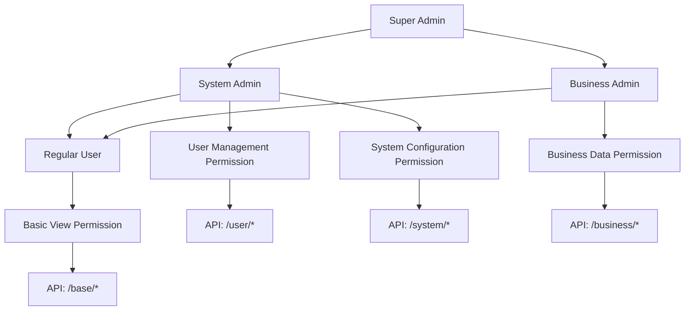

# 🛡️ Permission System

Gin-Vue-Admin uses Casbin to implement Role-Based Access Control (RBAC), providing a flexible and powerful permission management mechanism that supports multi-level permission control.

## 🎯 Permission Model Overview

### RBAC Permission Model

```
User ──┐
       ├─→ Role ──→ Permission ──→ Resource
Group ┘
```

### Permission Hierarchy Structure



## 🔧 Casbin Configuration

### Model Configuration File

Location: `server/resource/rbac_model.conf`

```ini
[request_definition]
r = sub, obj, act

[policy_definition]
p = sub, obj, act

[role_definition]
g = _, _

[policy_effect]
e = some(where (p.eft == allow))

[matchers]
m = g(r.sub, p.sub) && r.obj == p.obj && r.act == p.act
```

### Configuration Parameter Description

| Configuration Item | Description |
|--------------------|-------------|
| `request_definition` | Request definition: subject (sub), object (obj), action (act) |
| `policy_definition` | Policy definition: permission rule format |
| `role_definition` | Role definition: role inheritance relationships |
| `policy_effect` | Policy effect: conditions for allowing access |
| `matchers` | Matchers: permission verification logic |

## 🛠️ Core Components

### Casbin Middleware

Location: `server/middleware/casbin_rbac.go`

```go
// CasbinHandler Casbin permission verification middleware
func CasbinHandler() gin.HandlerFunc {
    return func(c *gin.Context) {
        claims, _ := c.Get("claims")
        waitUse := claims.(*utils.CustomClaims)
        
        // Get request information
        obj := c.Request.URL.Path
        act := c.Request.Method
        sub := waitUse.AuthorityId
        
        // Casbin permission verification
        e := casbinService.Casbin()
        success, _ := e.Enforce(sub, obj, act)
        
        if !success {
            response.FailWithDetailed(gin.H{}, "Insufficient permissions", c)
            c.Abort()
            return
        }
        c.Next()
    }
}
```

### Casbin Service

Location: `server/service/sys_casbin.go`

```go
type CasbinService struct{}

// UpdateCasbin Updates Casbin permissions
func (casbinService *CasbinService) UpdateCasbin(authorityId string, casbinInfos []request.CasbinInfo) error {
    casbinService.ClearCasbin(0, authorityId)
    rules := [][]string{}
    for _, v := range casbinInfos {
        rules = append(rules, []string{authorityId, v.Path, v.Method})
    }
    e := casbinService.Casbin()
    success, _ := e.AddPolicies(rules)
    if !success {
        return errors.New("Duplicate API exists, addition failed, please contact the administrator")
    }
    return nil
}

// GetPolicyPathByAuthorityId Retrieves permission list
func (casbinService *CasbinService) GetPolicyPathByAuthorityId(authorityId string) (pathMaps []request.CasbinInfo) {
    e := casbinService.Casbin()
    list := e.GetFilteredPolicy(0, authorityId)
    for _, v := range list {
        pathMaps = append(pathMaps, request.CasbinInfo{
            Path:   v[1],
            Method: v[2],
        })
    }
    return pathMaps
}

// ClearCasbin Clears permissions
func (casbinService *CasbinService) ClearCasbin(v int, p ...string) bool {
    e := casbinService.Casbin()
    success, _ := e.RemoveFilteredPolicy(v, p...)
    return success
}

// Casbin Retrieves Casbin instance
func (casbinService *CasbinService) Casbin() *casbin.Enforcer {
    return global.GVA_CASBIN
}
```

## 🏗️ Permission Data Structure

### Role Table (sys_authorities)

```go
type SysAuthority struct {
    CreatedAt     time.Time
    UpdatedAt     time.Time
    DeletedAt     *time.Time `sql:"index"`
    AuthorityId   string     `json:"authorityId" gorm:"not null;unique;primary_key;comment:角色ID;size:90"`
    AuthorityName string     `json:"authorityName" gorm:"comment:角色名"`
    ParentId      string     `json:"parentId" gorm:"comment:父角色ID"`
    DataAuthorityId []string `json:"dataAuthorityId" gorm:"-"`
    Children      []SysAuthority `json:"children" gorm:"-"`
    SysBaseMenus  []SysBaseMenu  `json:"menus" gorm:"many2many:sys_authority_menus;"`
    Users         []SysUser      `json:"-" gorm:"many2many:sys_user_authority;"`
    DefaultRouter string `json:"defaultRouter" gorm:"comment:默认菜单;default:dashboard"`
}
```

### Permission Rule Table (casbin_rule)

```go
type CasbinRule struct {
    ID    uint   `gorm:"primaryKey;autoIncrement"`
    Ptype string `gorm:"size:512;uniqueIndex:unique_index"`
    V0    string `gorm:"size:512;uniqueIndex:unique_index"`
    V1    string `gorm:"size:512;uniqueIndex:unique_index"`
    V2    string `gorm:"size:512;uniqueIndex:unique_index"`
    V3    string `gorm:"size:512;uniqueIndex:unique_index"`
    V4    string `gorm:"size:512;uniqueIndex:unique_index"`
    V5    string `gorm:"size:512;uniqueIndex:unique_index"`
}
```

### API Permission Table (sys_apis)

```go
type SysApi struct {
    global.GVA_MODEL
    Path        string `json:"path" gorm:"comment:api路径"`
    Description string `json:"description" gorm:"comment:api中文描述"`
    ApiGroup    string `json:"apiGroup" gorm:"comment:api组"`
    Method      string `json:"method" gorm:"default:POST;comment:方法"`
}
```

## 🎛️ Permission Management Features

### 1. Role Management

#### Create Role

```go
// CreateAuthority 创建角色
func (authorityService *AuthorityService) CreateAuthority(auth system.SysAuthority) (authority system.SysAuthority, err error) {
    var authorityBox system.SysAuthority
    if !errors.Is(global.GVA_DB.Where("authority_id = ?", auth.AuthorityId).First(&authorityBox).Error, gorm.ErrRecordNotFound) {
        return auth, errors.New("存在相同角色id")
    }
    err = global.GVA_DB.Create(&auth).Error
    return auth, err
}
```

#### Role Inheritance

```go
// 设置角色继承关系
e := casbinService.Casbin()
e.AddRoleForUser("user1", "role1")  // 用户继承角色
e.AddRoleForUser("role1", "role2")  // 角色继承角色
```

### 2. API Permission Management

#### Assign API Permissions

```go
// UpdateCasbinApi 更新API权限
func (casbinService *CasbinService) UpdateCasbinApi(oldPath string, newPath string, oldMethod string, newMethod string) error {
    err := global.GVA_DB.Model(&gormadapter.CasbinRule{}).Where("v1 = ? AND v2 = ?", oldPath, oldMethod).Updates(map[string]interface{}{
        "v1": newPath,
        "v2": newMethod,
    }).Error
    e := casbinService.Casbin()
    err = e.LoadPolicy()
    return err
}
```

#### API Permission Verification

```go
// 权限验证示例
func checkPermission(userId, path, method string) bool {
    e := casbinService.Casbin()
    
    // 获取用户角色
    roles := e.GetRolesForUser(userId)
    
    // 检查权限
    for _, role := range roles {
        if ok, _ := e.Enforce(role, path, method); ok {
            return true
        }
    }
    return false
}
```

### 3. Menu Permission Management

#### Menu Permission Table (sys_base_menus)

```go
type SysBaseMenu struct {
    global.GVA_MODEL
    MenuLevel     uint                                     `json:"-"`
    ParentId      string                                   `json:"parentId" gorm:"comment:父菜单ID"`
    Path          string                                   `json:"path" gorm:"comment:路由path"`
    Name          string                                   `json:"name" gorm:"comment:路由name"`
    Hidden        bool                                     `json:"hidden" gorm:"comment:是否在列表隐藏"`
    Component     string                                   `json:"component" gorm:"comment:对应前端文件路径"`
    Sort          int                                      `json:"sort" gorm:"comment:排序标记"`
    Meta          `json:"meta" gorm:"embedded;comment:附加属性"`
    SysAuthoritys []SysAuthority                          `json:"authoritys" gorm:"many2many:sys_authority_menus;"`
    Children      []SysBaseMenu                           `json:"children" gorm:"-"`
    Parameters    []SysBaseMenuParameter                  `json:"parameters"`
    MenuBtn       []SysBaseMenuBtn                        `json:"menuBtn"`
}
```

#### Dynamic Menu Generation

```go
// GetMenuTree 获取动态菜单树
func (menuService *MenuService) GetMenuTree(authorityId string) (menus []system.SysMenu, err error) {
    menuTree, err := menuService.getMenuTreeMap(authorityId)
    menus = menuTree["0"]
    for i := 0; i < len(menus); i++ {
        err = menuService.getChildrenList(&menus[i], menuTree)
    }
    return menus, err
}
```

### 4. Button Permission Management

#### Button Permission Table (sys_base_menu_btns)

```go
type SysBaseMenuBtn struct {
    global.GVA_MODEL
    Name          string `json:"name" gorm:"comment:按钮关键key"`
    Desc          string `json:"desc" gorm:"comment:按钮备注"`
    SysBaseMenuID uint   `json:"sysBaseMenuID" gorm:"comment:菜单ID"`
}
```

#### Frontend Button Permission Control

```vue
<template>
  <!-- 使用 v-auth 指令控制按钮显示 -->
  <el-button v-auth="'user:create'" @click="createUser">
    创建用户
  </el-button>
  
  <el-button v-auth="'user:delete'" @click="deleteUser">
    删除用户
  </el-button>
</template>

<script>
// 权限指令实现
app.directive('auth', {
  mounted(el, binding) {
    const { value } = binding
    const userStore = useUserStore()
    
    if (!userStore.hasPermission(value)) {
      el.style.display = 'none'
    }
  }
})
</script>
```

## 🔄 Permission Synchronization Mechanism

### Permission Cache Update

```go
// 权限变更时同步缓存
func (casbinService *CasbinService) FreshCasbin() (err error) {
    e := casbinService.Casbin()
    err = e.LoadPolicy()
    return err
}

// 清除用户权限缓存
func (casbinService *CasbinService) ClearUserCache(userId string) {
    // 清除Redis中的用户权限缓存
    global.GVA_REDIS.Del(context.Background(), "user:permissions:"+userId)
}
```

### Real-time Permission Verification

```go
// 实时权限检查
func (casbinService *CasbinService) CheckPermission(userId, resource, action string) bool {
    // 1. 检查缓存
    cacheKey := fmt.Sprintf("permission:%s:%s:%s", userId, resource, action)
    if result, err := global.GVA_REDIS.Get(context.Background(), cacheKey).Result(); err == nil {
        return result == "true"
    }
    
    // 2. 实时验证
    e := casbinService.Casbin()
    hasPermission, _ := e.Enforce(userId, resource, action)
    
    // 3. 缓存结果
    global.GVA_REDIS.Set(context.Background(), cacheKey, hasPermission, time.Minute*5)
    
    return hasPermission
}
```

## 🎨 Frontend Permission Integration

### Route Permission Control

```javascript
// router/permission.js
import { useUserStore } from '@/pinia/modules/user'

router.beforeEach(async (to, from, next) => {
  const userStore = useUserStore()
  
  // 检查登录状态
  if (!userStore.token) {
    if (to.path !== '/login') {
      return next('/login')
    }
    return next()
  }
  
  // 检查路由权限
  if (to.meta.requiresAuth) {
    const hasPermission = await userStore.checkRoutePermission(to.path)
    if (!hasPermission) {
      return next('/403')
    }
  }
  
  next()
})
```

### API Permission Interception

```javascript
// utils/request.js
import axios from 'axios'
import { useUserStore } from '@/pinia/modules/user'

// 请求拦截器
axios.interceptors.request.use(
  config => {
    const userStore = useUserStore()
    
    // 添加 Token
    if (userStore.token) {
      config.headers['x-token'] = userStore.token
    }
    
    return config
  },
  error => Promise.reject(error)
)

// 响应拦截器
axios.interceptors.response.use(
  response => response,
  error => {
    if (error.response?.status === 403) {
      // 权限不足处理
      ElMessage.error('权限不足')
      return Promise.reject(error)
    }
    
    if (error.response?.status === 401) {
      // Token 过期处理
      const userStore = useUserStore()
      userStore.logout()
      router.push('/login')
    }
    
    return Promise.reject(error)
  }
)
```

## 🔒 Security Best Practices

### 1. Principle of Least Privilege
- Users only receive the minimum permissions necessary to perform their work.
- Regularly review and clean up unnecessary permissions.
- Implement time-limited permissions.

### 2. Permission Separation
- Separate management permissions from business permissions.
- Separate read permissions from write permissions.
- Sensitive operations require additional verification.

### 3. Audit Logs
```go
// 权限操作日志
type PermissionLog struct {
    UserID    string    `json:"user_id"`
    Action    string    `json:"action"`
    Resource  string    `json:"resource"`
    Result    bool      `json:"result"`
    IP        string    `json:"ip"`
    UserAgent string    `json:"user_agent"`
    Timestamp time.Time `json:"timestamp"`
}

// 记录权限操作
func LogPermissionCheck(userID, action, resource string, result bool, c *gin.Context) {
    log := PermissionLog{
        UserID:    userID,
        Action:    action,
        Resource:  resource,
        Result:    result,
        IP:        c.ClientIP(),
        UserAgent: c.GetHeader("User-Agent"),
        Timestamp: time.Now(),
    }
    
    // 记录到数据库或日志文件
    global.GVA_LOG.Info("Permission Check", zap.Any("log", log))
}
```

## 🐛 Common Issues

### Q: Permissions not taking effect after modification?
A: You need to call `e.LoadPolicy()` to reload the permission policy, or restart the application.

### Q: How to implement data permission control?
A: You can add a data scope field in the Casbin rule, or use a custom data filter.

### Q: How to optimize permission verification performance?
A: Use Redis to cache permission results, and set a reasonable cache expiration time.

### Q: How to implement temporary permissions?
A: You can add a time field in the permission rule, or use a scheduled task to clean up expired permissions.

## 📚 Related Documents

- [Authentication System](./authentication.md)
- [Common Issues](../manual/qa.md)
- [Server Configuration](./config.md)
- [Casbin Official Documentation](https://casbin.org/)